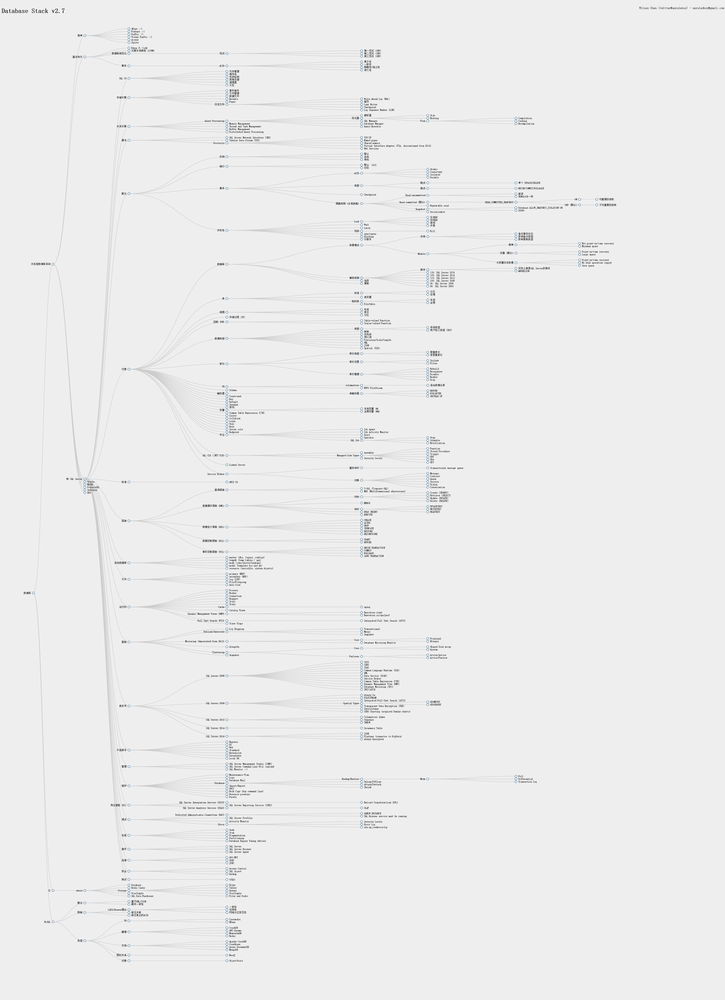

# SQL Monitor
想优化SQL Server的功能吗？看看SQL Monitor吧！它可以管理SQL Server进程和作业、分析系统、版本控制、建议性能改进等。

https://github.com/unruledboy/SQLMonitor

# 爆栈
系统开发技术栈、Web前端开发技术栈、数据库技术栈、.NET技术栈！
http://overflowstack.github.io

# 本地化
English: 
https://github.com/unruledboy/DatabaseStack/

中文博客: 
http://www.cnblogs.com/unruledboy/p/DatabaseStack.html

# 数据库技术栈
比较全面的数据库技术栈，包括MS SQL Server、Azure等。

# 为什么？
大家是否想过：
* 数据库开发究竟包含哪些技术呢？
* 我所掌握的技术这个子集，在数据库技术大系这个超集里面占的比例是多少呢？
* 我究竟还没有掌握多少数据库技术呢？
* 面试的时候会考哪些技术呢？

那么，数据库开发是否也应该有这样的技术栈概览图呢？搜索了很久，没有找到一个符合我要求的“较为全面”地表述数据库技术大系的图表。所以我们自行设计了这个数据库技术栈。

这个图表里的分类未必准确，相关技术也难免会有遗漏，欢迎大家指点以便不断改进。

数据库技术实在太繁多限于篇幅，这里没有罗列一些技术。

您可以点击下面链接查看交互式预览图(用鼠标移动/缩放/点击节点打开相关网站)：

https://rawgit.com/unruledboy/DatabaseStack/master/ux/DatabaseStack.htm?locale=zh-cn

<!--BUILD_START-->

- 数据库
	- 关系型数据库系统
		- 简单
			- [dBase ;-)](https://en.wikipedia.org/wiki/DBase)
			- Foxbase ;-)
			- [FoxPro ;-)](https://en.wikipedia.org/wiki/FoxPro)
			- [Visual FoxPro ;-)](https://msdn.microsoft.com/en-us/vfoxpro/bb190225.aspx)
			- [Access](https://products.office.com/en-us/access)
			- [Sqlite](https://www.sqlite.org/)
		- 基本知识
			- [Edgar F. Codd](https://en.wikipedia.org/wiki/Edgar_F._Codd)
			- [对象关系映射 (O/RM)](https://en.wikipedia.org/wiki/Object-relational_mapping)
			- [数据库规范化](https://en.wikipedia.org/wiki/Database_normalization)
				- 范式
					- 第一范式 (1NF)
					- 第二范式 (1NF)
					- 第三范式 (1NF)
			- [事务](https://en.wikipedia.org/wiki/Database_transaction)
				- [ACID](https://en.wikipedia.org/wiki/ACID)
					- 原子性
					- 一致性
					- 隔离性/独立性
					- 持久性
		- [MS SQL Server](http://www.microsoft.com/en-us/server-cloud/products/sql-server/)
			- SQL OS
				- 内存管理
				- 缓存池
				- 死锁检测
				- 异常处理
				- 调度器
				- 交互
			- 存储引擎
				- 事务服务
				- 文件管理
				- 数据文件
				- Extents
				- Pages
				- 日志文件
					- Write Ahead Log (WAL)
					- 脏页
					- Lazy Writer
					- Checkpoint
					- Log Sequence Number (LSN)
			- 关系引擎
				- Query Processing
					- 解析器
					- 优化器
						- Stat
						- Hinting
						- Plan
							- Compilation
							- Caching
							- Recompilation
					- SQL Manager
					- Database Manager
					- Query Executor
				- Memory Management
				- Thread and Task Management
				- Buffer Management
				- Distributed Query Processing
			- 通讯
				- SQL Server Network Interface (SNI)
				- Tabular Data Stream (TDS)
				- Protocols
					- TCP/IP
					- Named pipes
					- Shared memory
					- Virtual Interface Adapter (VIA, discontinued from 2012)
					- Web Services
			- 概念
				- 实例
					- 默认
					- 命名
					- 别名
				- 端口
					- 默认: 1433
					- 动态
				- 事务
					- ACID
						- Atomic
						- Consistent
						- Isolated
						- Durable
					- 类型
						- 隐式
							- 单个 UPDATE/DELETE
						- 显式
							- BEGIN/COMMIT/ROLLBACK
					- Checkpoint
					- [隔离级别 (从低到高)](https://technet.microsoft.com/en-us/library/ms189122(v=sql.105).aspx)
						- Read uncommitted
							- 脏读
							- 和NOLOCK一样
						- Read committed (默认)
							- READ_COMMITTED_SNAPSHOT
								- ON
									- 可重复的读取
								- OFF (默认)
									- 不可重复的读取
						- Repeatable read
						- Snapshot
							- Database ALLOW_SNAPSHOT_ISOLATION ON
							- 2005+
						- Serializable
				- 并发性
					- Lock
						- 乐观锁
						- 悲观锁
						- 排他
						- 共享
					- Wait
					- Latch
					- 死锁
						- Kill
					- sync/async
					- Blocking
					- 行版本
			- 对象
				- 数据库
					- 恢复模式
						- 作用
							- 备份事务日志
							- 影响备份类型
							- 影响复制类型
						- Models
							- 简单
								- Not point-in-time recovery
								- Minimum space
							- 完整 (默认)
								- Point-in-time recovery
								- Large space
							- 大容量日志恢复
								- Point-in-time recovery
								- No bulk operation logged
								- Save space
					- 兼容级别
						- 版本
							- 实际上就是SQL Server的版本
							- @@VERSION
						- 130: SQL Server 2016
						- 120: SQL Server 2014
						- 110: SQL Server 2012
						- 100: SQL Server 2008
						- 90: SQL Server 2005
						- 80: SQL Server 2000
					- 加密
					- 复制
				- 表
					- 标准
						- 分区
						- 压缩
					- 表变量
					- 临时表
						- 本地
						- 全局
					- FileTable
				- 视图
					- 标准
					- 索引
					- 分区
				- 存储过程 (SP)
				- 函数 (FN)
					- Table-valued Function
					- Scalar-valued Function
				- 数据类型
					- 类型
						- 系统类型
						- 用户定义类型 (UDT)
					- 转换
					- 优先级
					- 同义词
					- Precision/Scale/Length
					- XML
					- JSON
					- Spatial (CLR)
				- 索引
					- 索引类型
						- 聚集索引
						- 非聚集索引
					- 索引设置
						- Include
						- Filter
					- 索引管理
						- Rebuild
						- Reorganise
						- Disable
						- Enable
						- Drop
				- 列
					- columnstore
						- 适合数据仓库
					- NTFS FileStream
				- Schema
				- 触发器
					- 表触发器
						- BEFORE
						- FOR/AFTER
						- INSTEAD OF
				- Constraint
				- Key
				- Default
				- Synonym
				- 序列
				- 变量
					- 本地变量 (@)
					- 全局变量 (@@)
				- Common Table Expression (CTE)
				- Cursor
				- Collation
				- Login
				- User
				- Rule
				- Server role
				- Endpoint
				- 作业
					- Job Agent
					- Job Activity Monitor
					- Alert
					- Operator
					- SQL Job
						- Step
						- Schedule
						- Notification
				- SQL CLR (.NET CLR)
					- Assembly
					- Managed Code Types
						- Function
						- Stored Procedure
						- Trigger
						- UDF
						- UDA
						- UDT
					- Security Levels
				- Linked Server
				- Service Broker
					- 基本知识
						- Transactional message queue
					- 对象
						- Message
						- Contract
						- Queue
						- Service
						- Dialog
						- Conversation
			- 标准
				- ANSI 92
			- 语言
				- 查询语言
					- T-SQL (Transact-SQL)
					- MDX (MultiDimensional eXpressions)
				- 数据操作语言 (DML)
					- CRUD
						- Create (INSERT)
						- Retrieve (SELECT)
						- Update (UPDATE)
						- Delete (DELETE)
					- MERGE
					- TEXT
						- UPDATETEXT
						- WRITETEXT
						- READTEXT
					- BULK INSERT
					- EXECUTE
				- 数据定义语言 (DDL)
					- CREATE
					- ALTER
					- DROP
					- TRUNCATE
					- RESTORE
					- RECONFIGURE
				- 数据控制语言 (DCL)
					- GRANT
					- REVOKE
				- 事务控制语言 (TCL)
					- BEGIN TRANSACTION
					- COMMIT
					- ROLLBACK
					- SAVE TRANSACTION
			- 系统数据库
				- master (dbs, logins, configs)
				- tempdb (temp tables / sps)
				- msdb (jobs/alerts/backups)
				- model (template for new db)
				- resource (invisible, system objects)
			- 文件
				- primary (MDF)
				- secondary (NDF)
				- log (LDF)
				- File/Filegroup
				- Auto Grow
			- 运行时
				- Process
				- Worker
				- Connection
				- Request
				- Stall
				- Stats
				- Query Store
				- Cache
					- aging
				- Catalog Views
				- Dynamic Management Views (DMV)
					- Execution count
					- Execution io/cpu/perf
				- Full Text Search (FTS)
					- Integrated Full Text Search (iFTS)
				- Trace flags
			- 复制
				- Log Shipping
				- Publish/Subscribe
					- Transactional
					- Merge
					- Snapshot
				- Mirroring (deprecated from 2012)
					- Core
						- Principal
						- Witness
					- Database Mirroring Monitor
				- AlwaysOn
				- Clustering
					- Core
						- Shared Disk Array
						- Quorum
					- Failover
						- Active/Active
						- Active/Passive
				- Snapshot
			- 版本号
				- SQL Server 2005
					- SSIS
					- SSRS
					- SSAS
					- Common Language Runtime (CLR)
					- XML
					- Data Service (SOAP)
					- Service Broker
					- Common Table Expression (CTE)
					- Dynamic Management View (DMV)
					- Database Mirroring (SP1)
					- TRY/CATCH
				- SQL Server 2008
					- Always On
					- FILESTREAM
					- Integrated Full-Text Search (iFTS)
					- Spatial Types
						- GEOMETRY
						- GEOGRAPHY
					- Transparent Data Encryption (TDE)
					- IntelliSense
					- SSRS Charting (acquired Dundas charts)
				- SQL Server 2012
					- Sequence
					- THROW
				- SQL Server 2014
					- In-memory Table
					- Clustered Columnstore Index
				- SQL Server 2016
					- Columnstore Index
					- In-memory OLTP
					- JSON
					- Query Store
					- Temporal Tables
					- Polybase (connector to BigData)
					- Always Encrypted
			- 产品版本
				- Express
				- BI
				- Web
				- Standard
				- Enterprise
				- Datacenter
				- Local DB
			- 管理
				- SQL Server Management Studio (SSMS)
				- SQL Server Command Line Util (sqlcmd)
				- [SQL Monitor ;-)](https://github.com/unruledboy/SQLMonitor)
			- 维护
				- Maintenance Plan
				- Logs
				- Database Mail
				- Database
					- Backup/Restore
						- Mode
							- Full
							- Differential
							- Transaction log
					- Online/Offline
					- Attach/Dettach
					- Shrink
				- Import/Export
				- DBCC
				- Bulk Copy (bcp command line)
				- Resource governor
				- Facets
			- 商业智能 (BI)
				- SQL Server Integration Service (SSIS)
					- Extract-Transform-Load (ETL)
				- SQL Server Reporting Service (SSRS)
				- SQL Server Analysis Service (SSAS)
					- OLAP
			- 调试
				- Dedicated Administrator Connection (DAC)
					- ADMIN:INSTANCE
					- SQL Browser service must be running
				- SQL Server Profiler
				- Activity Monitor
				- Error
					- Severity Levels
					- Error Log
					- sys.xp_readerrorlog
			- 性能
				- Seek
				- Scan
				- Fragmentation
				- Partitioning
				- Database Engine Tuning Advisor
			- 服务
				- SQL Server
				- SQL Server Browser
				- SQL Server Agent
			- 连接
				- ADO.NET
				- ODBC
				- JDBC
			- 安全
				- Access Control
				- SQL Inject
				- Backup
			- 测试
				- [tSQLt](http://tsqlt.org/)
		- [Oracle](https://www.oracle.com/database/)
		- [MySQL](https://www.mysql.com/)
		- [PostgreSQL](http://www.postgresql.org/)
		- [Informix](http://www.ibm.com/software/data/informix)
		- [DB2](http://www.ibm.com/software/data/db2)
	- 云
		- [Azure](https://azure.microsoft.com)
			- Database
			- Redis Cache
			- Storage
				- Blobs
				- Tables
				- Queues
				- Files and Disks
			- StorSimple
			- SQL Data Warehouse
	- [NoSQL](https://en.wikipedia.org/wiki/NoSQL)
		- 概念
			- 基于XML/JSON
			- 最终一致性
		- 限制
			- [CAPS/Brewer理论](https://en.wikipedia.org/wiki/CAP_theorem)
				- 一致性
				- 可用性
				- 网络分区容忍性
			- 缺乏关联
			- 缺乏真正的ACID
		- 类型
			- 列
				- [Cassandra](http://cassandra.apache.org/)
				- [HBase](http://hbase.apache.org/)
			- 键值
				- [CouchDB](http://couchdb.apache.org/)
				- [AWS Dynamo](https://aws.amazon.com/dynamodb/)
				- [MemcacheDB](http://memcachedb.org/)
				- [Redis](http://redis.io/)
			- 文档
				- [Apache CouchDB](http://couchdb.apache.org/)
				- [Couchbase](http://www.couchbase.com/)
				- [Azure DocumentDB](http://azure.microsoft.com/en-us/services/documentdb/)
				- [MongoDB](https://www.mongodb.org/)
			- 图形关系
				- [Neo4J](http://neo4j.com/)
			- 对象
				- [ObjectStore](http://www.objectstore.com/)

<!--BUILD_END-->	
